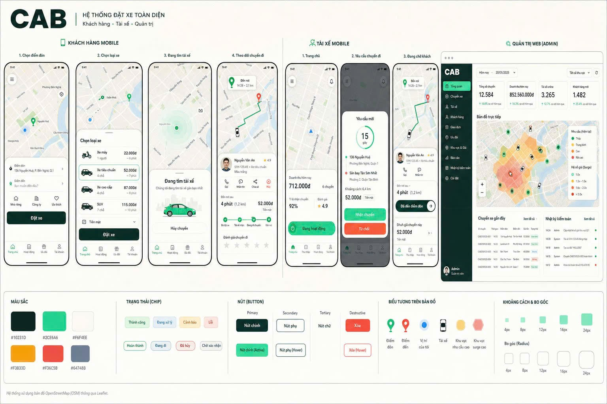
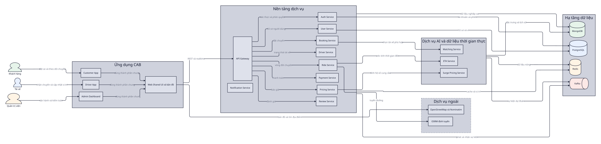
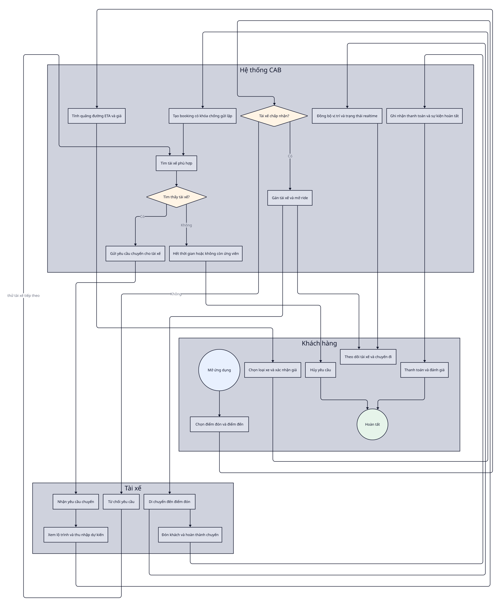
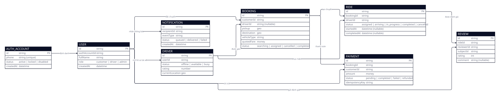
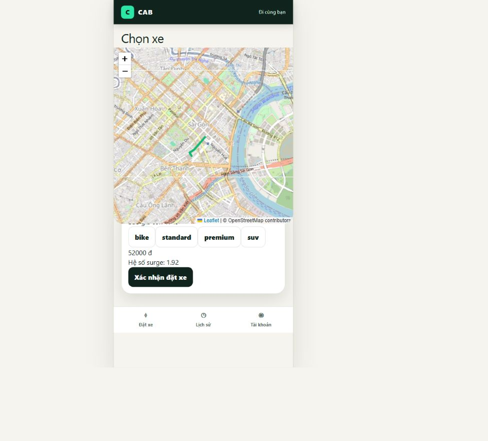
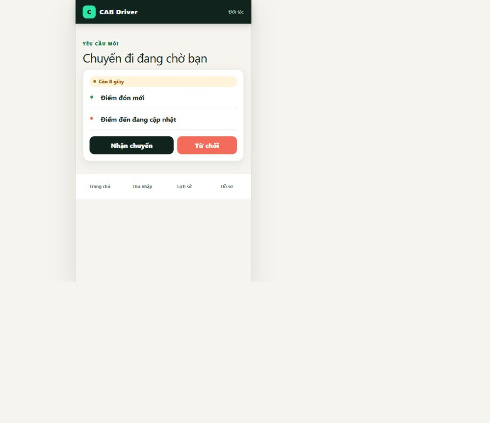
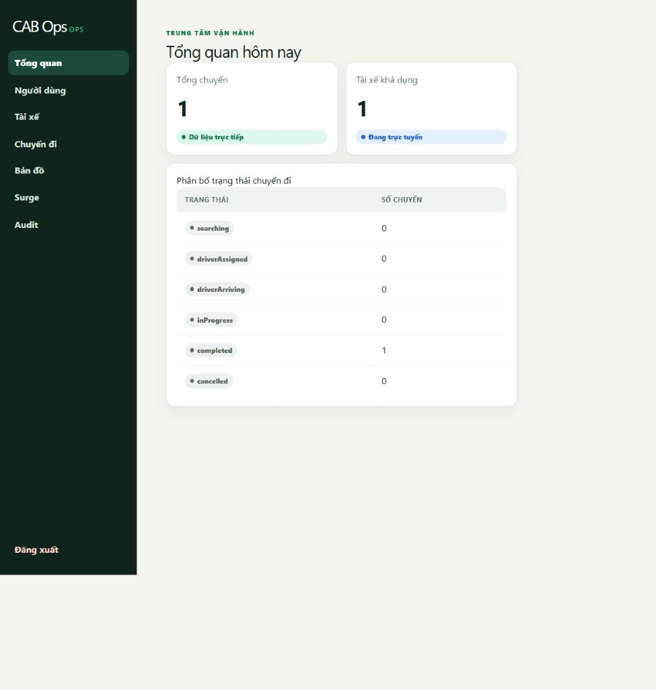

<div align="center">

[🇻🇳 Tiếng Việt](README.md) · **🇬🇧 English**

# CAB — Intelligent Ride Booking System

**A multi-role ride-hailing platform built on microservices, event-driven architecture and AI assistance**

Customers book rides · Drivers accept requests in realtime · Admins operate the fleet · AI powers matching, ETA and surge pricing


</div>



---

## Table of contents

0. [Performance Benchmarks](#0-performance-benchmarks)
1. [Problem and architectural direction](#1-problem-and-architectural-direction)
2. [Features by role](#2-features-by-role)
3. [Overall architecture](#3-overall-architecture)
4. [Technology stack](#4-technology-stack)
5. [System design and core techniques](#5-system-design-and-core-techniques)
6. [Business flows](#6-business-flows)
7. [Data model](#7-data-model)
8. [Verified user interface](#8-verified-user-interface)
9. [Running the project](#9-running-the-project)
10. [Repository structure](#10-repository-structure)

---

## 0. Performance Benchmarks

### 0.1. Load test

| Scenario | Load | Requests/checks | HTTP errors | Throughput | p95 | Threshold | Status |
|---|---:|---:|---:|---:|---:|---:|---|
| Booking via gateway after tuning | 10→100 VU / 2 min | 13,424 / 13,424 | 0% | 111.1 req/s | **679.9 ms** | <300 ms | ❌ Latency not met |
| ETA via gateway | 50 VU / 1 min | 9,872 / 9,872 | 0% | ~164 req/s | **340.98 ms** | <200 ms | ❌ Latency not met |
| ETA warm cache, direct service | 50 VU | 36,741 / 36,741 | 0% | ~604 req/s | **82.34 ms** | <200 ms | ✅ Pass |
| Pricing surge spike | 5→80 VU / 10 s | 3,508 / 3,508 | 0% | ~85.5 req/s | 1,471.9 ms | No latency target | ✅ Checks/error-rate pass |

Booking p95 improved from **1,150.9 ms to 679.9 ms** (~41%) and throughput went from 63.8 to 111.1 req/s, but gate T14 is still open until we get below 300 ms.

### 0.2. Security microbenchmarks

| Measurement | Result |
|---|---:|
| Verify JWT RS256 | p50 0.095 ms · p95 0.20 ms · p99 0.31 ms |
| Verify JWT throughput, single core | 8,732 tokens/s |
| RBAC / ABAC decision | ~0.4 µs / ~0.6 µs |
| JWKS cache | 1 fetch / 10,000 verifies |
| Broken-access matrix | blocks 11/11 escalations; allows 15/15 legitimate |
| Argon2id | ~27 ms/hash · p95 39.2 ms · 19 MB |
| mTLS handshake, localhost | ~1.7 ms overhead |

### 0.3. Evidence and reproduction

- Full report, environment, SHA-256 table and bottleneck analysis: [benchmark_report.md](docs/reports/benchmark_report.md).
- k6 scenarios: [guide](tests/load/README.md), [booking](tests/load/booking-load.js), [ETA](tests/load/eta-load.js), [pricing](tests/load/spike-pricing.js).
- Security benchmarks: [report](docs/benchmarks/security/cv-security-metrics-2026-08-20.md), [sec-bench.mjs](docs/benchmarks/security/sec-bench.mjs), [mtls-bench.mjs](docs/benchmarks/security/mtls-bench.mjs).
- Baseline in the report: commit `aa665d3bdd6a2dbd48d773e677035d8e3ac0864e`, 2026-08-26.

---

## 1. Problem and architectural direction

CAB handles a continuous business chain: search for locations, quote a fare, create a booking, pick a driver, stream location updates, complete the ride, take payment and collect a rating. The system is split by domain but keeps a single API Gateway as the unified entry point.

| Problem | Risk | Decision |
|---|---|---|
| Booking retried due to flaky network | Duplicate rides/events | Idempotency key and safe replay |
| Matching needs a fast response | Distant, busy or double-booked drivers | Geo filtering, matching score, offer/decline round |
| Location changes constantly | Stale UI or wrong state | Redis, realtime events and map markers |
| Independent service failures | Cascading outage | Circuit breaker, timeout and Kafka |
| Price depends on supply/demand | Inconsistent fares | Pricing domain, capped surge and AI fallback |

---

## 2. Features by role

### Customer

- OTP login; pick pickup/dropoff on the map.
- See ETA, distance, vehicle class and quoted fare before booking.
- Search for a driver, cancel a request, track location/status in realtime.
- Pay, review ride history and rate after the trip.

### Driver

- OTP login, toggle availability and stream location.
- Receive requests in realtime, review route/earnings, accept or decline.
- Progress through `assigned → arriving → in_progress → completed`.
- View earnings, ride history and profile.

### Admin

- Password + MFA login, review operations overview.
- Manage users, drivers, rides and supply.
- Monitor the map, surge zones and audit logs.

---

## 3. Overall architecture



Editable source: [cab-system.d2](docs/_shared/d2-architect/cab-system.d2).

- The gateway centralises auth, routing, rate limiting, error shaping and correlation context.
- PostgreSQL stores structured accounts/profiles; MongoDB stores flexible operational data.
- Kafka carries events; Redis holds cache, hot state and locations.
- Matching, ETA and surge are AI capabilities with fallbacks.

---

## 4. Technology stack

| Layer | Technology |
|---|---|
| Frontend | React 18, Vite, React Router, Leaflet, OpenStreetMap, Socket.IO client |
| Gateway/backend | Node.js, Express, JWT/JWKS, RBAC/ABAC, circuit breaker |
| AI/ML | Python, FastAPI, matching score, ETA, surge prediction |
| Data | MongoDB 7, PostgreSQL 16, Redis 7 |
| Event-driven | Apache Kafka 3.7 |
| Testing | Node test, Pytest, Supertest, k6, direct browser E2E |
| Local runtime | npm workspaces, Docker Compose profiles |

---

## 5. System design and core techniques

### API Gateway

The frontend hits a single entry point. The gateway authenticates, attaches request context, routes and normalises errors. A route registry catches missing or wrong routes before they leak into the UI.

### Event-driven and replay safety

Kafka decouples producers from consumers. Booking commits domain state, then emits events via a dispatcher/outbox; consumers rely on event ID / idempotency key so replay never doubles side-effects.

### Realtime ride lifecycle

Driver availability, ride requests, location and ride status are streamed in realtime. The driver UI tolerates both `driver.assigned` and `ride.assigned` during the contract transition.

### Resilience and Zero-Trust

Timeouts, circuit breakers, bounded retries and AI fallbacks stop cascading failure. JWT RS256/JWKS, RBAC/ABAC, header spoofing defence, rate limiting and audit logs form layered controls.

---

## 6. Business flows



Source: [book-and-complete-ride.d2](docs/cab-core/d2/book-and-complete-ride.d2). The flow covers the happy path, no driver found, driver declines, next-candidate retry and customer cancel.

---

## 7. Data model



Source: [cab-core.d2](docs/cab-core/d2-erd/cab-core.d2). This is a cross-domain logical model; IDs represent business references, not literal foreign keys or joins across databases/services.

---

## 8. Verified user interface

| Customer | Driver | Admin |
|---|---|---|
|  |  |  |
| Quote with pickup/dropoff markers | Realtime ride request | Operations overview |

Screenshots were captured from a browser after running the UI directly against the local Docker backend. See the [full screenshot set](docs/screenshots/).

---

## 9. Running the project

Requires Node.js 20+, npm, Docker Desktop and `.env.docker` files created from `.env.docker.example`.

```powershell
npm install
docker compose -f infra/docker-compose/docker-compose.local.yml up -d
npm run smoke
```

Core + AI + frontend containers:

```powershell
docker compose -f infra/docker-compose/docker-compose.local.yml --profile ai --profile web up -d
```

| App | URL |
|---|---|
| Customer | `http://localhost:5174` |
| Driver | `http://localhost:5175` |
| Admin | `http://localhost:5176` |
| Gateway | `http://localhost:3000` |

Dev mode: `npm run dev:customer`, `npm run dev:driver`, `npm run dev:admin`. Full test suite: `npm run test:all`.

---

## 10. Repository structure

```text
CAB-Ride-Booking-System/
├── apps/                 # customer, driver, admin React apps
├── packages/web-shared/  # design tokens, UI primitives, map markers
├── gateway/api-gateway/  # HTTP/realtime entry point
├── services/             # auth, user, booking, driver, ride, payment...
├── AI-ML/                # matching, ETA, surge, insights
├── platform/             # topology and resilience/security layers
├── infra/                # Docker Compose and Docker Swarm
├── tests/load/           # k6 scenarios and thresholds
├── scripts/chaos/        # resilience experiments
└── docs/                 # architecture, benchmark, diagrams, screenshots
```

## Related documents

- [Overall architecture](docs/architecture/01-overall-architecture.md)
- [Deployment architecture](docs/architecture/02-deployment-architecture.md)
- [Unified UI design](docs/superpowers/specs/2026-08-26-cab-unified-ui-design.md)
- [UI implementation plan](docs/superpowers/plans/2026-08-26-cab-unified-ui-implementation.md)
- [Mapping and running guide](docs/mapping_and_running_guide.md)
