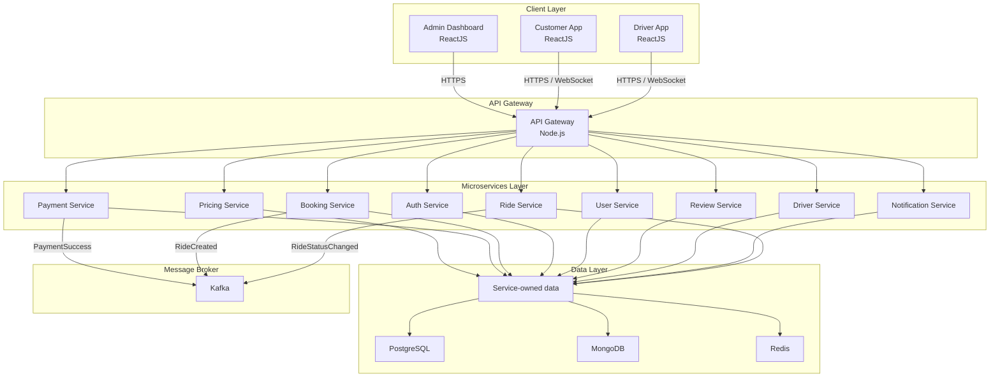

# CAB Booking System - Overall Architecture

## 1. Pham vi tai lieu

Tai lieu nay chi mo ta `kien truc tong quan` cua du an theo dung so do da duoc cung cap. Muc tieu la chot khung he thong de cac kien truc tiep theo (trien khai, bao mat, nghiep vu service, database, CI/CD) duoc gan vao dung vi tri.

## 2. Rang buoc kien truc da chot

- Kieu kien truc: `Microservice + Event-driven`
- Frontend: `ReactJS`
- Backend: `Node.js`
- Trien khai: `Docker Swarm`
- CI/CD: `GitHub`
- Giao tiep ben ngoai: `REST`
- Giao tiep noi bo:
  - `REST` cho request-response
  - `Kafka` cho event-driven
- Nguyen tac kien truc:
  - `Database per service`
  - `Stateless services`
  - `Async-first (Event-driven)`
  - `Zero trust security`
  - `Observability by design`

## 3. Cau truc tong the theo so do



Luu y:

- So do tren chi chot `overall architecture`.
- Message broker trong anh duoc khoa thanh `Kafka` theo yeu cau hien tai cua du an.
- Khong bo sung them service moi ngoai 9 service co trong anh.
- Mapping service xuong tung loai database chua duoc chot o tai lieu nay; overall architecture chi khoa `Data Layer = PostgreSQL + MongoDB + Redis` va `database ownership theo service`.

## 4. Mo ta tung layer

### 4.1 Client Layer

Client Layer gom 3 ung dung ReactJS:

- `Admin Dashboard`: giao dien quan tri he thong.
- `Customer App`: giao dien khach hang dat xe, theo doi chuyen di, thanh toan.
- `Driver App`: giao dien tai xe nhan chuyen, cap nhat trang thai, theo doi cuoc xe.

Quy tac giao tiep:

- Tat ca client di qua `API Gateway`.
- `Admin Dashboard` su dung `HTTPS`.
- `Customer App` va `Driver App` su dung `HTTPS` va `WebSocket` qua Gateway cho cac nhu cau real-time.

### 4.2 API Gateway

`API Gateway` la diem vao duy nhat cua he thong backend.

Vai tro trong kien truc tong quan:

- Nhan request tu 3 client.
- Dinh tuyen request REST toi dung microservice.
- Lam diem ket noi WebSocket cho luong real-time di qua Gateway.
- Khong chua nghiep vu domain.

### 4.3 Microservices Layer

Microservices Layer duoc giu dung theo anh, gom 9 service:

| Service | Vai tro trong kien truc tong quan |
| --- | --- |
| `Pricing Service` | Xu ly thong tin gia cuoc va du tinh gia. |
| `Payment Service` | Xu ly thanh toan va phat event `PaymentSuccess`. |
| `Booking Service` | Tiep nhan yeu cau dat xe va phat event `RideCreated`. |
| `Auth Service` | Xac thuc va quan ly thong tin truy cap. |
| `User Service` | Quan ly thong tin tai khoan nguoi dung. |
| `Review Service` | Quan ly danh gia va nhan xet. |
| `Driver Service` | Quan ly thong tin tai xe va trang thai san sang. |
| `Notification Service` | Gui thong bao den cac client. |
| `Ride Service` | Quan ly vong doi chuyen di, cap nhat trang thai va phat event `RideStatusChanged`. |

Quy tac giao tiep noi bo:

- `REST` duoc dung cho giao tiep dong bo giua Gateway va service, hoac giua service voi service khi can request-response.
- `Kafka` duoc dung cho giao tiep bat dong bo theo event.
- Service khong duoc phep truy cap database cua service khac.

### 4.4 Data Layer

Data Layer trong kien truc tong quan gom:

- `PostgreSQL`
- `MongoDB`
- `Redis`

Ap dung dung nguyen tac `Database per service`:

- Moi service so huu du lieu cua rieng no.
- Viec cung su dung chung cong nghe `PostgreSQL`, `MongoDB`, `Redis` khong co nghia la chia se schema/domain.
- Khong co truy cap cheo database giua cac service.

### 4.5 Message Broker

Message Broker cua he thong la `Kafka`.

Trong overall architecture hien tai, cac event duoc chot theo anh:

- `PaymentSuccess`
- `RideCreated`
- `RideStatusChanged`

Message Broker chi dung de van chuyen event giua cac service, khong chua nghiep vu domain.

## 5. Quy tac ket noi kien truc

### 5.1 Luat giao tiep

- Client chi goi vao `API Gateway`, khong goi truc tiep microservice.
- Giao tiep ben ngoai dung `REST`.
- Giao tiep noi bo dung:
  - `REST` cho luong dong bo
  - `Kafka` cho luong bat dong bo
- Luong real-time tu client di qua `WebSocket` tren Gateway.

### 5.2 Luat service

- Moi service la `stateless`.
- Moi service la mot don vi deploy doc lap.
- Moi service tu quan ly data ownership cua minh.
- Moi service chi expose contract qua API hoac event.

### 5.3 Luat bao mat o muc tong quan

- Toan bo truy cap ben ngoai di qua `HTTPS`.
- Kien truc duoc xay dung theo `Zero trust security`.
- Moi request deu duoc xem la khong tin cay cho den khi duoc xac minh o cac lop kien truc tiep theo.

### 5.4 Luat quan sat he thong

- `Observability by design` la rang buoc bat buoc cua toan bo he thong.
- Gateway va tat ca service deu phai san sang cho logging, metrics va tracing o cac kien truc trien khai tiep theo.

## 6. Khung thu muc du an theo kien truc tong quan

```text
Project-BookingCab-Ver2/
|-- apps/
|   |-- admin-dashboard/
|   |-- customer-app/
|   `-- driver-app/
|-- gateway/
|   `-- api-gateway/
|-- services/
|   |-- pricing-service/
|   |-- payment-service/
|   |-- booking-service/
|   |-- auth-service/
|   |-- user-service/
|   |-- review-service/
|   |-- driver-service/
|   |-- notification-service/
|   `-- ride-service/
|-- data-layer/
|   |-- postgresql/
|   |-- mongodb/
|   `-- redis/
|-- message-broker/
|   `-- kafka/
|-- infra/
|   `-- docker-swarm/
|-- .github/
|   `-- workflows/
`-- docs/
    `-- architecture/
        `-- 01-overall-architecture.md
```

## 7. Cach ap kien truc nay vao du an

Trong giai doan hien tai, `overall architecture` duoc hieu nhu sau:

- Moi `app`, `gateway`, `service` la mot module doc lap trong workspace.
- Moi module backend se duoc phat trien bang `Node.js`.
- Moi module frontend se duoc phat trien bang `ReactJS`.
- `Docker Swarm` va `GitHub CI/CD` da duoc dat san vi tri trong khung thu muc, nhung chi tiet stack file/workflow se duoc thiet ke o kien truc tiep theo.

## 8. Trang thai chot cho kien truc tong quan

Phan kien truc tong quan nay da chot dung theo anh da gui:

- Dung 3 client app.
- Dung 1 API Gateway.
- Dung 9 microservice.
- Dung 3 thanh phan data layer: `PostgreSQL`, `MongoDB`, `Redis`.
- Dung 1 message broker: `Kafka`.
- Dung REST cho giao tiep ben ngoai.
- Dung REST va Kafka cho giao tiep noi bo.
- Khong them service, khong doi topology, khong doi layer.
