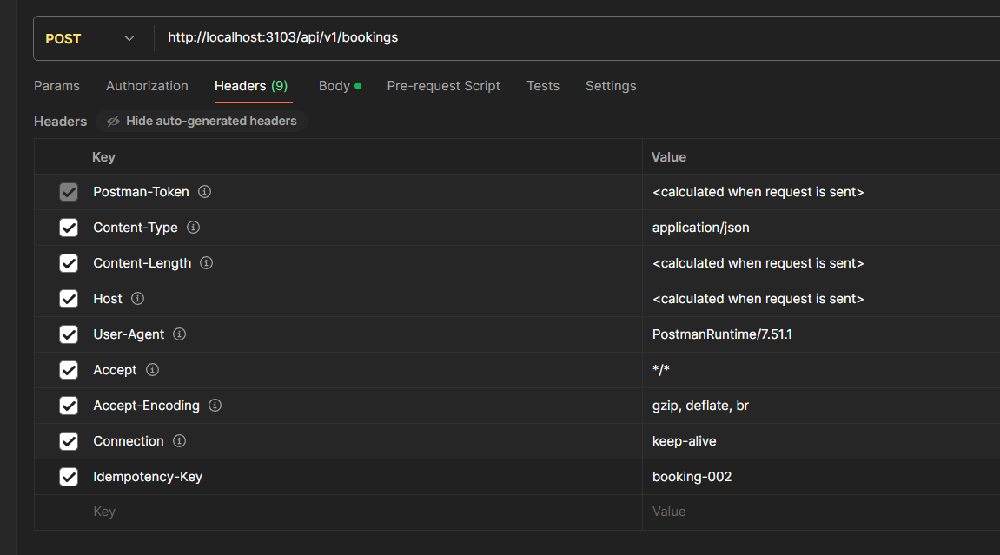
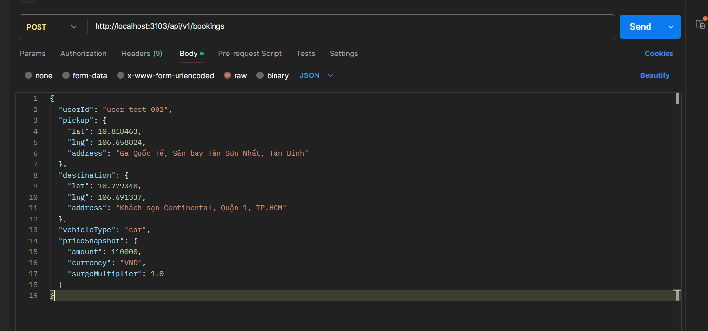
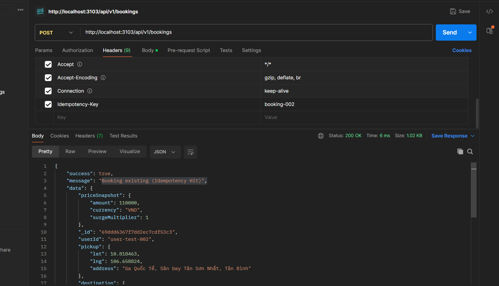
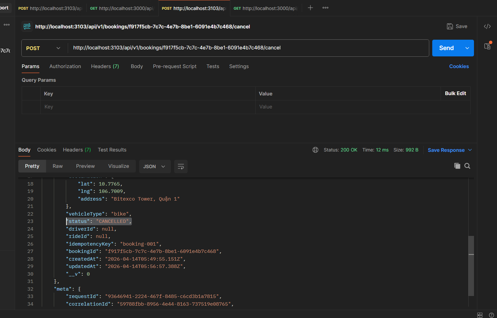
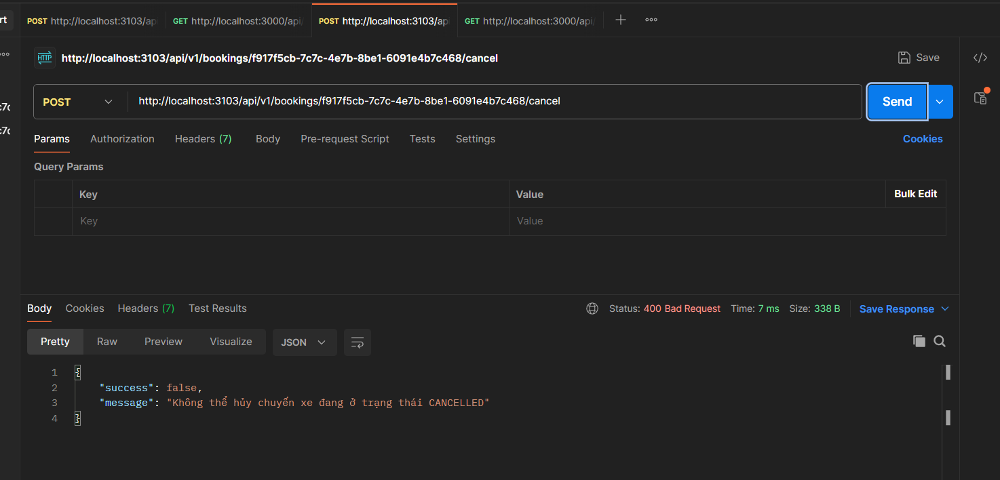
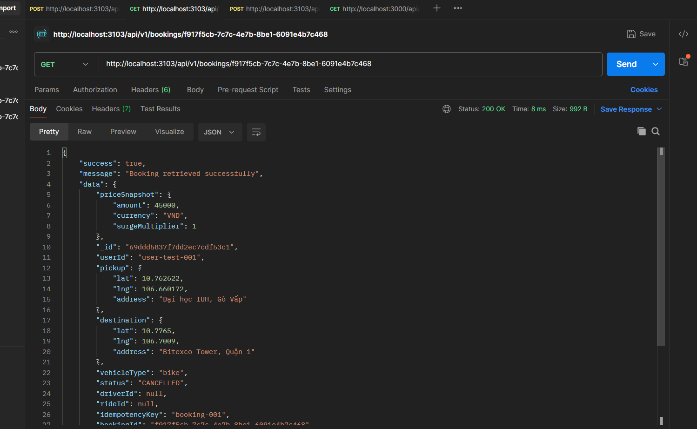
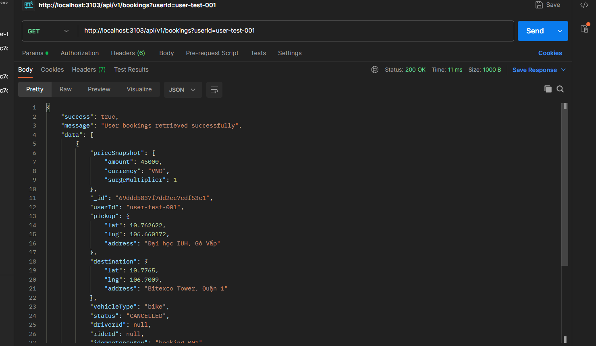
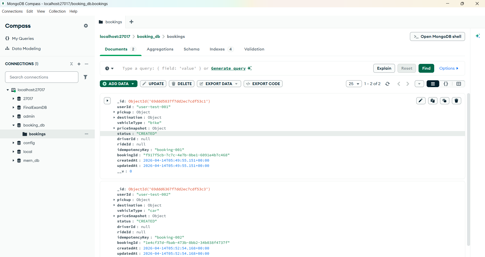

1. tạo chuyến xe:
- method: post
- url: http://localhost:3103/api/v1/bookings
- header (key-value): (Idempotency-Key   -    booking-002) mỗi lần create là 1 value khác nhau

- ví dụ tạo chuyến mới với value booking-car-003
- dữ liệu test
{
  "userId": "user-test-002",
  "pickup": {
    "lat": 10.818463,
    "lng": 106.658824,
    "address": "Ga Quốc Tế, Sân bay Tân Sơn Nhất, Tân Bình"
  },
  "destination": {
    "lat": 10.779348,
    "lng": 106.691337,
    "address": "Khách sạn Continental, Quận 1, TP.HCM"
  },
  "vehicleType": "car",
  "priceSnapshot": {
    "amount": 110000,
    "currency": "VND",
    "surgeMultiplier": 1.0
  }
}

- cơ chế trùng Idempotency-Key nên khi tạo 1 booking mới nó sẽ không tạo thêm record nếu trùng Idempotency-Key
- ví dụ tạo tiếp chuyến khác với value = booking-002 (đã tạo ở trên), nó sẽ hiện thông báo booking exist

2. hủy chuyến
- method: post
- url: http://localhost:3103/api/v1/bookings/{{bookingId}}/cancel
- lưu ý là bookingId chứ không phải _id
- khi cancel hệ thống sẽ thay đổi trạng thái từ create sang cancel chứ ko phải xóa chuyến này khỏi database

nếu tiếp tục hủy chuyến có status là canceled thì sẽ thông báo
{
    "success": false,
    "message": "Không thể hủy chuyến xe đang ở trạng thái CANCELLED"
}

3. Lấy thông tin chi tiết 1 chuyến xe
- method: get
- url: http://localhost:3103/api/v1/bookings/{{bookingId}}

4. xem user đã dặt chuyến nào
- method: get
- url: http://localhost:3103/api/v1/bookings?userId={{userId}}

csdl mongodb

